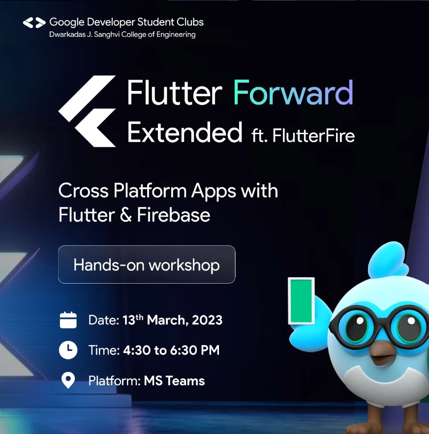
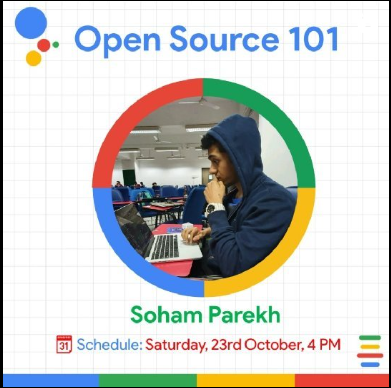

<!DOCTYPE html>
<html lang="en">

<head>
    <meta charset="UTF-8">
    <meta name="viewport" content="width=device-width, initial-scale=1.0">
    <title>GDSC DJSCE Events</title>
    <link rel="preconnect" href="https://fonts.googleapis.com">
    <link rel="preconnect" href="https://fonts.gstatic.com" crossorigin>
    <link href="https://fonts.googleapis.com/css2?family=Julius+Sans+One&display=swap" rel="stylesheet">
    <link href="https://fonts.googleapis.com/css2?family=Kiwi+Maru:wght@300&display=swap" rel="stylesheet">
    <link href="https://fonts.googleapis.com/css2?family=Source+Sans+3:wght@300&display=swap" rel="stylesheet">
    <link href="./style.css" rel="stylesheet">
</head>

<body>
    

        
        
GDSC DJSCE

        

            <a class="navTopElements" href="https://gdsc-djsce.netlify.app/">Home</a>
            <a class="navTopElements" href="./index.html">Events</a>
            <a class="navTopElements" href="https://gdsc-djsce.netlify.app/team">Team</a>
            <a class="navTopElements" href="https://gdsc-djsce.netlify.app/contact">Contact</a>
        

    

    

    

        <h3 style="color: white;">Upcoming Events</h3>
    

    

    

        
         
    

    

        
<a href="https://gdsc-djsce.netlify.app/events/2" style="text-decoration: none;">Description of the Event</a>

        
<a href="https://gdsc-djsce.netlify.app/events" style="text-decoration: none;">Description of the Event</a>

    

     
     
     
     
     
    

    

        <a href="./index.html" style="text-decoration: none;"><h3 style="color: white;">All</h3></a>
        <a href="./sessions.html" style="text-decoration: none;"><h3 style="color: white;">Sessions</h3></a>
        <a href="./festivals.html" style="text-decoration: none;"><h3 style="color: white;">Festivals</h3></a>       
    

    

    

        
        
        
        
        
        
        
        
    

    

        <a href="https://gdsc-djsce.netlify.app/events/2">
FLUTTER FESTIVAL
</a>
        

             Date : XXth Month 20XX
             Time : 3:30pm - 5:30pm
        

        <a href="https://gdsc-djsce.netlify.app/events">
HACKNICHE
</a>
        

             Date : XXth Month 20XX
             Time : 3:30pm - 5:30pm
        

        <a href="https://gdsc-djsce.netlify.app/events">
CLOUD-A-THON
</a>
        

             Date : XXth Month 20XX
             Time : 3:30pm - 5:30pm
        

        <a href="https://gdsc-djsce.netlify.app/events/5">
ANDROID JAM 1
</a>
        

             Date : XXth Month 20XX
             Time : 3:30pm - 5:30pm
        

        <a href="https://gdsc-djsce.netlify.app/events/4">
ANDROID JAM 2
</a>
        

             Date : XXth Month 20XX
             Time : 3:30pm - 5:30pm
        

        <a href="https://gdsc-djsce.netlify.app/events/8">
GOOGLE CLOUD
</a>
        

             Date : XXth Month 20XX
             Time : 3:30pm - 5:30pm
        

        <a href="https://gdsc-djsce.netlify.app/events/6">
PIXEL HACK
</a>
        

             Date : XXth Month 20XX
             Time : 3:30pm - 5:30pm
        

        <a href="https://gdsc-djsce.netlify.app/events/7">
OPEN SOURCE
</a>
        

             Date : XXth Month 20XX
             Time : 3:30pm - 5:30pm
        
  
    

     
     
     
     
     
     
    

    

        

            
            
GDSC DJSCE

        

        

            
COMMUNITY

            
FOLLOW US

        

    
 
    

        

            
<a href = "https://gdsc-djsce.netlify.app/" class = "endInfo">About Us</a>

            
<a href = "https://gdsc-djsce.netlify.app/team" class = "endInfo">Team</a>

            
<a href = "./index.html" class = "endInfo">Upcoming Events</a>

        

        

            
<a href = "https://www.instagram.com/gdsc.djsce/" class = "endInfo">Instagram</a>

            
<a href = "https://www.linkedin.com/company/gdsc-djsce/" class = "endInfo">LinkedIn</a>

        

    

     
     
    

     
     
</body>
</html>

